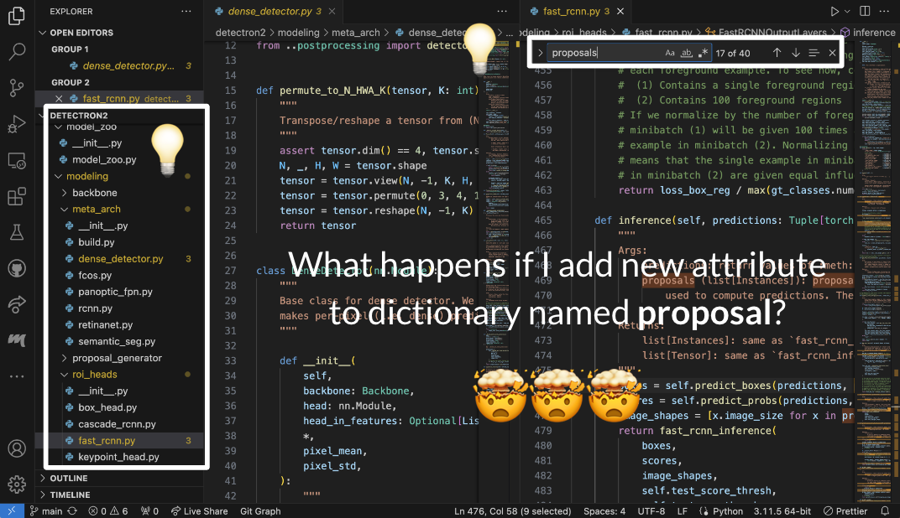

# CodeXplorer: An AI-Assisted Codebase Navigation
## Problem: Large codebases take time to navigate

## File structure
- `example1`, `example2`: example repositories including the example tasks
- `my-app`: React.js frontend. 
- `server`: Backend
- `ai`: AI pipeline

Note that each components have separate READMEs.
